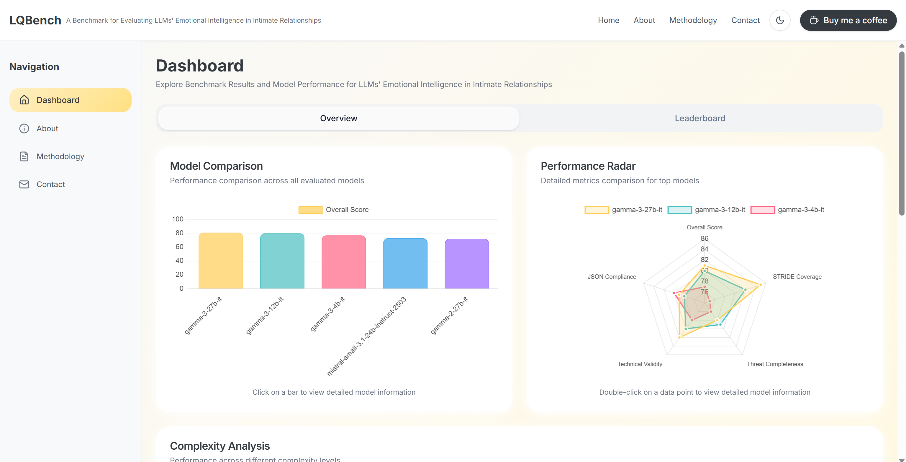
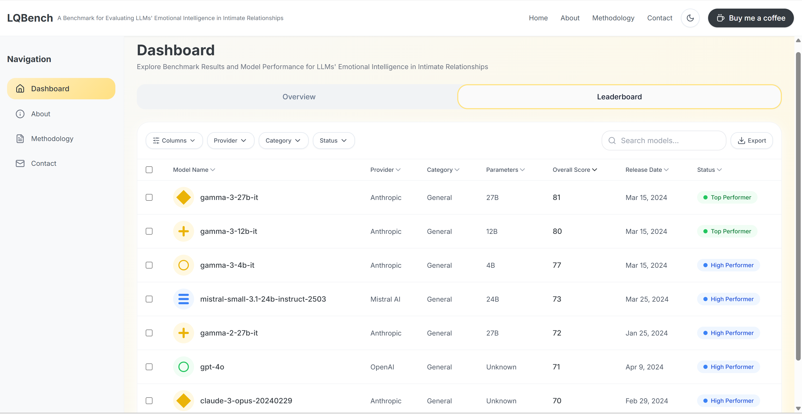
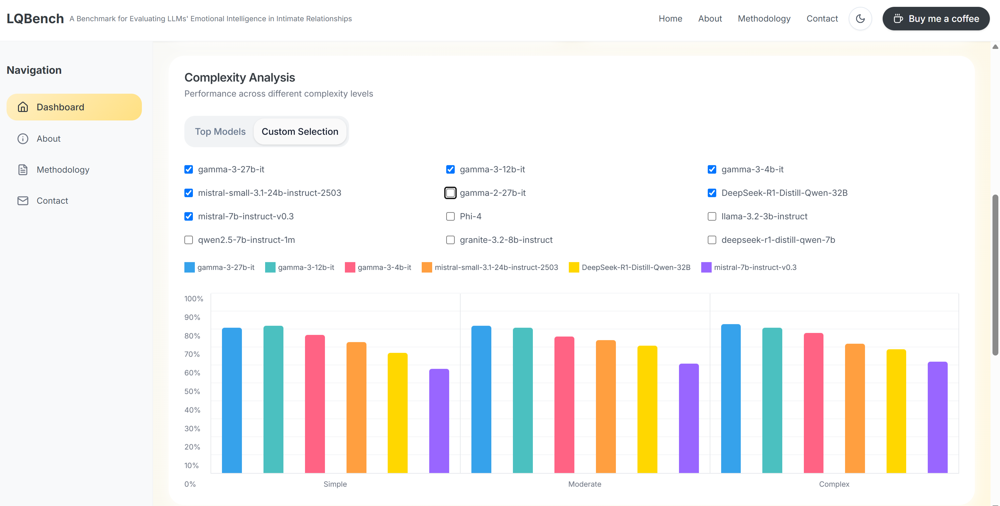
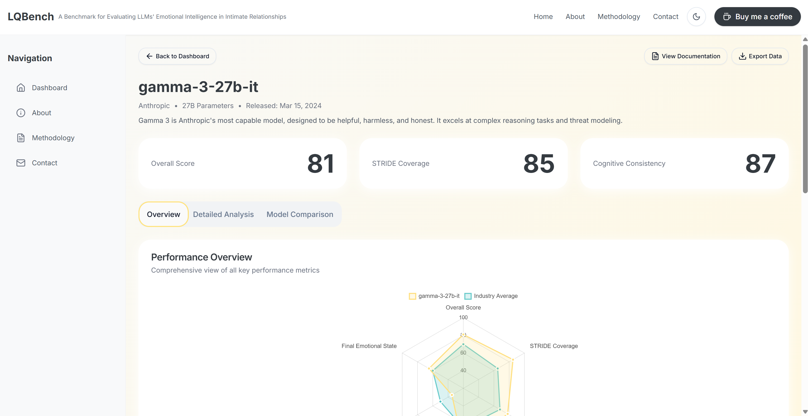

# LQBench Dashboard

LQBench Dashboard is a modern, interactive data visualization platform designed to showcase and analyze the emotional intelligence performance of Large Language Models (LLMs) in intimate relationships. The data populated inside is not real.

## 📸 Media Showcase

### Screenshots

*Main dashboard interface with model performance overview*


*Detailed model performance leaderboard*


*Task complexity analysis visualization*

### Model specific page Demo Video
It includes scoring of all aspects of the model, as well as support for selecting models for comparison and downloading model data.
[](assets/videos/dashboard-demo.mp4)
*Click to watch the full demo video*

## 🌟 Key Features

### 1. Model Performance Overview
- Interactive bar charts comparing all evaluated models
- Radar charts for detailed metrics comparison of top models
- Dark/Light theme support

### 2. Model Leaderboard
- Detailed model performance rankings
- Multi-dimensional metrics display
- Sorting and filtering capabilities

### 3. Complexity Analysis
- Performance visualization across different task complexities
- Intuitive chart representations
- Detailed performance metrics analysis

### 4. Task Type Analysis
- Performance breakdown by task type
- Interactive data visualization
- In-depth task performance analysis

## 🛠️ Tech Stack

- **Frontend Framework**: Next.js 14
- **UI Components**: Custom component library + Tailwind CSS
- **Data Visualization**: Custom chart components
- **Theme Support**: Dark/Light mode
- **Responsive Design**: Multi-device support

## 🎨 UI Features

- Modern UI design
- Smooth interaction experience
- Clear data presentation
- Responsive layout
- Elegant animations

## 📊 Data Visualization

- Model performance comparison
- Multi-dimensional metrics analysis
- Task complexity analysis
- Task type distribution
- Detailed model information

## 🚀 Quick Start

1. Clone the repository
```bash
git clone https://github.com/yourusername/lqbench_dashboard.git
```

2. Install dependencies
```bash
pnpm install
```

3. Start the development server
```bash
pnpm dev
```

4. Visit http://localhost:3000

## 📝 Project Structure

```
lqbench_dashboard/
├── app/                # Page routes and layouts
├── components/         # Reusable components
├── lib/               # Utility functions and configs
├── public/            # Static assets
├── styles/            # Global styles
└── assets/            # Project resources
    ├── screenshots/   # Screenshot images
    └── videos/        # Demo videos
```

## 🤝 Contributing

We welcome Pull Requests and Issues to help improve the project.

## 📄 License

MIT License 